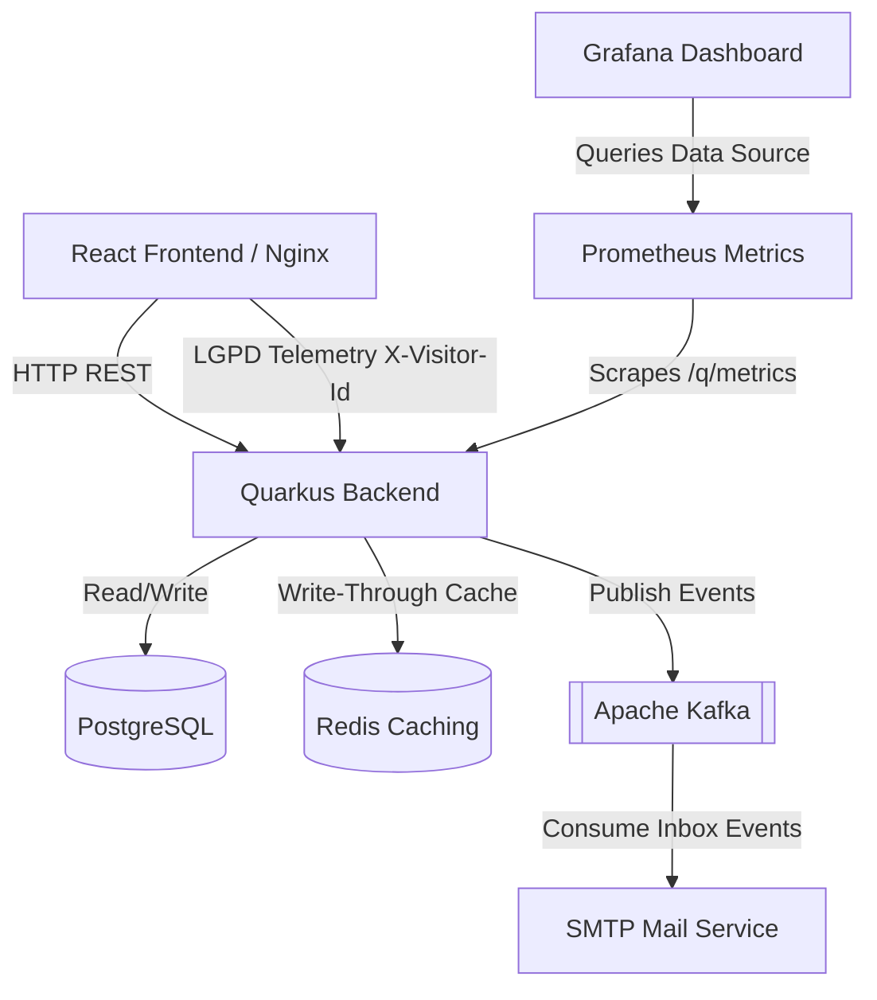

# flima.dev — Platform Architecture & Monorepo

Welcome to the main repository for **flima.dev**, a state-of-the-art Systems Architect Portfolio and Content Management System. This monorepo houses both the frontend client and the backend API, alongside Kubernetes deployment configurations and local developer tooling.

---

## 🏗️ High-Level Architecture

The platform is designed around cloud-native, asynchronous, and high-performance design patterns:



### Components

1. **Frontend (`/frontend`)**: A React 19 SPA bundled with Vite, leveraging Redux Toolkit (RTK Query) for cached client state. Operates in strict LGPD compliance (GDPR alignment) with cookie consent checks, static `/privacy` pages, and anonymous `visitor_id` tracking.
2. **Backend (`/backend`)**: A Quarkus (Java 21) REST API. Features proactive resource constraints (`JAVA_OPTS`), Flyway migration pipelines, custom rate-limiting (`Bucket4j`), and secure JWT token generation for the admin dashboard.
3. **Caching Layer (`k8s/redis`)**: Redis caching built with Quarkus Cache extension to optimize public endpoints (Experiences, Educations, Projects, Stacks) with automatic write-through cache invalidation.
4. **Messaging & Mailer**: Uses Apache Kafka for decoupling inbound contact messages. An asynchronous consumer picks up the messages and dispatches SMTP emails to the site owner.
5. **Observability Stack (`monitoring/`)**: Built-in Prometheus scraping config mapping metrics to a Grafana dashboard for real-time memory, CPU, HTTP requests, and Kafka latency metrics.

---

## 🛠️ Local Development (Quick Start)

### Prerequisites

- **Node.js** v18+ & **npm** v10+
- **Java JDK** 21+
- **Docker** & **Docker Compose**

### Running the Infrastructure

To start the databases, Kafka broker, and maildev mock servers locally:

```bash
docker compose up -d
```

This starts:
* **PostgreSQL** at `localhost:5432`
* **Redis** at `localhost:6379`
* **Kafka** at `localhost:9092`
* **Prometheus** at `localhost:9090`
* **Grafana** at `localhost:3000`

### Running the Services

1. **Start the Quarkus Backend**:
   ```bash
   cd backend
   ./mvnw quarkus:dev
   ```
   *The API will be available at `http://localhost:8080`.*

2. **Start the React Frontend**:
   ```bash
   cd frontend
   npm install
   npm run dev
   ```
   *The app will be available at `http://localhost:5173`.*

---

## 🛡️ Admin Credentials (Local)

To log into the administration panel in development mode:
- **Route**: `/login`
- **Username**: `admin`
- **Password**: `root`

---

## 🚀 GitOps & Kubernetes Production Deployment

The production environment is managed using **ArgoCD** (GitOps), sourcing manifests from the `./k8s` directory.

### Manifest Layout
- `/k8s/database`: PostgreSQL deployment, services, and PersistentVolumeClaims.
- `/k8s/redis`: Lightweight Redis alpine image deployment for caching.
- `/k8s/kafka`: Local Kafka cluster broker configurations.
- `/k8s/backend`: Quarkus API deployment with Probes and JVM Heap limit configurations.
- `/k8s/frontend`: Nginx-wrapped SPA client.
- `/monitoring`: Prometheus configuration and Grafana dashboards.

### Updating Versions (GitOps Trigger)
To trigger a new rolling update in the cluster, update the image versions inside:
- [k8s/backend/deployment.yaml]
- [k8s/frontend/deployment.yaml]
And commit the changes to your deployment branch.
